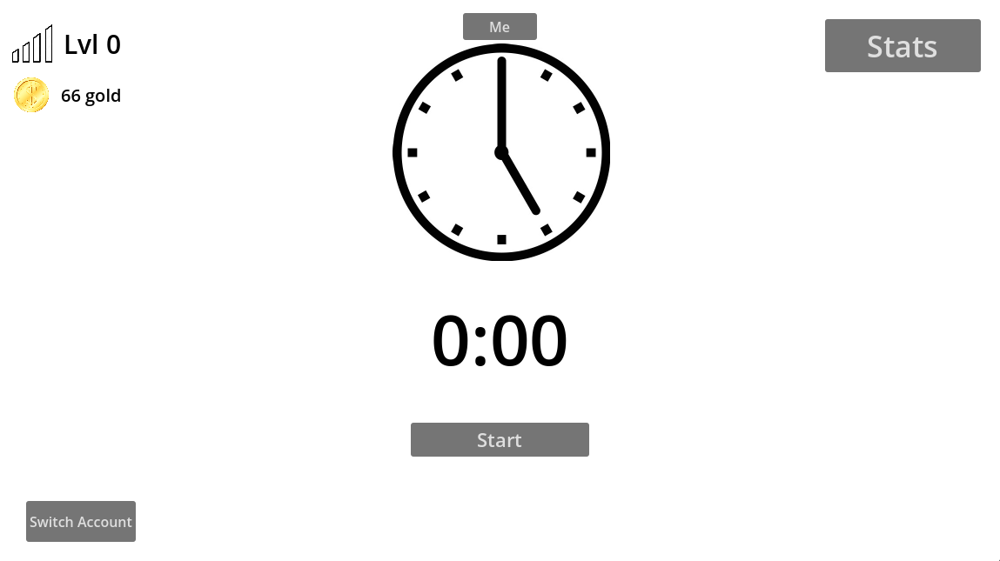
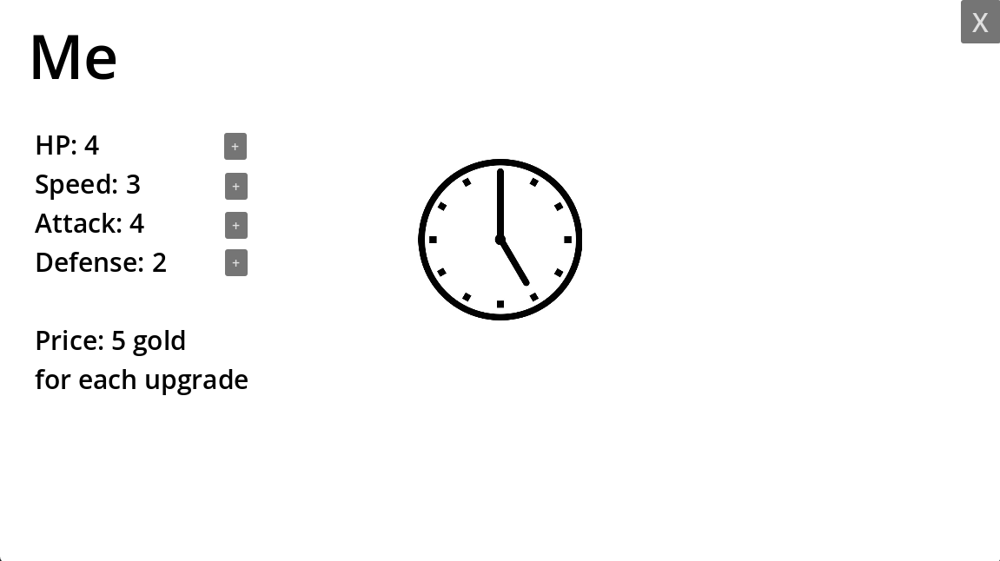
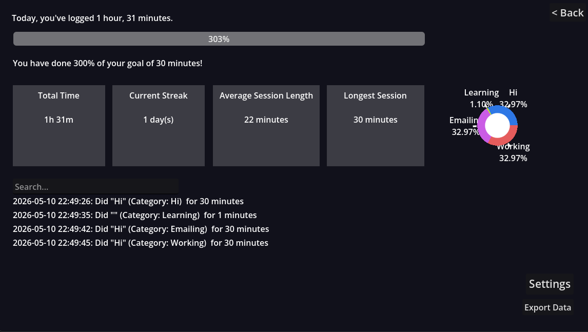

# Pace

A gamified application that tracks time and gives you gamified rewards.

|  |  |
| :-------------------------------------------------------------------: | :-------------------------------------------------------------------: |
|  |  |

## Usage Instructions

Grab the Pace client application and Pace server ZIP from Releases. Extract the server ZIP and run the binary appropriate for your OS. You can safely delete the other operating systems' binaries but DO NOT delete the templates folder. Also, make sure the templates folder is in the same folder as the binary, as it is by default. Then, run the Pace client application.

After that, navigate to http://localhost:8080 and enter your desired username and password to create the first user.

When you go to add a session in the app or use the login button, set the server URL to http://localhost:8080 and use the username and password that you created.

## Why I made this?

To motivate me to do productive things via gamified rewards.

## License

This repository is licensed under the GNU AGPL v3. See LICENSE for more details.
